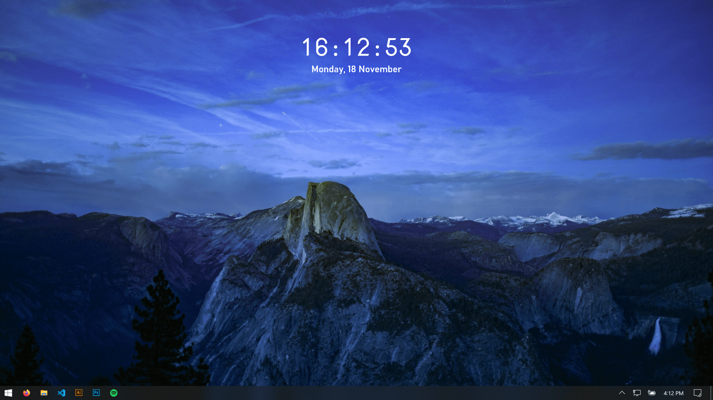

# desktop-clock
A clock widget for your desktop!

Written in Python using the Tk GUI toolkit. The clock displays the current system time and date, with customization options coming soon. Because the window only refreshes once every second, CPU and battery impact are minimal.
